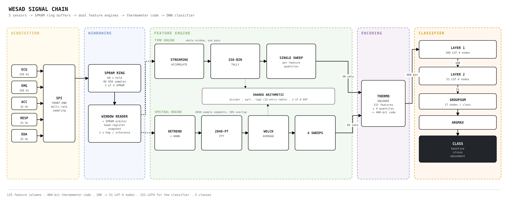
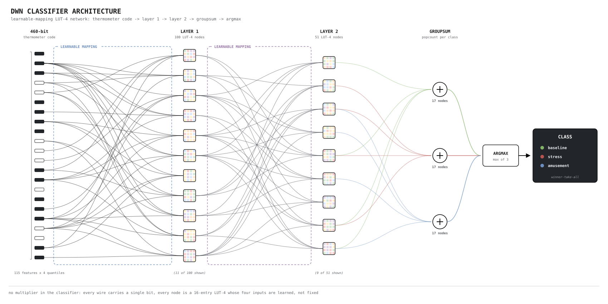
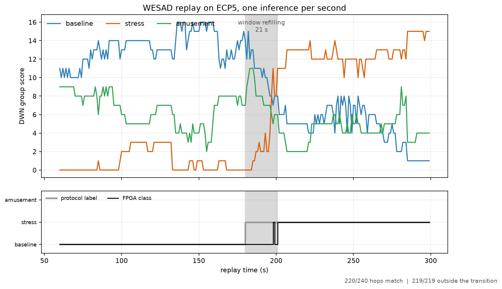

# Real-Time Multi-Sensor Analytics on an Ultra Low power FPGA

Stress classification from five biosignals, running entirely on an iCE40 UltraPlus,
no multiplier-based neural network, no external memory, no cloud. The classifier is a
**Differentiable Weightless Neural Network**: every neuron is a 4-input lookup table,
so inference is signals propagating through configured LUT4s with no arithmetic at all.

---

## Why weightless

A conventional network does multiply-accumulates, so on an FPGA it spends DSP blocks on
arithmetic and block RAM on weights. A weightless neuron *is* a lookup table: `n` input
bits form an address, the table emits a bit. One trained DWN node with `n=4` maps **1:1
onto one iCE40 LUT4**. This yields competitive accuracy at a small LUT count, and because
each node is a truth table rather than any arithmetic, the design is energy- and
latency-efficient.

Classic weightless networks could not be trained by gradient descent. Bacellar et al.
(ICML 2024) made the tables differentiable (Extended Finite Difference for gradients
through the LUT, Learnable Mapping to also learn which inputs each LUT sees), giving
modern training with LUT-native inference.

The measured consequence in this project: **the classifier costs 152 LUT4.** Roughly
**98 % of the design is feature extraction**, not inference.

---

## Target device: iCE40UP5K-SG48I

| resource | available | note |
|---|---|---|
| LUT4 / logic cells | 5280 | a LUT4 and a flip-flop share one cell |
| flip-flops | 5280 | same cells |
| DSP (`SB_MAC16`, 16×16) | 8 | the only hard multipliers on the part |
| EBR (block RAM) | 30 × 4 kbit = 120 kbit | dual-port; FFT scratch and coefficient tables |
| SPRAM | 4 × 256 kbit = 1024 kbit | single-port; the sensor ring buffers |
| PLL | 1 | |

---

## Signal chain



A 60-second window is held per modality in a circular buffer; one inference is produced
per one-second hop.

| modality | rate | samples / 60 s window |
|---|---|---|
| ECG | 250 Hz | 15 000 |
| EMG | 350 Hz | 21 000 |
| ACC (vector magnitude) | 32 Hz | 1 920 |
| Respiration | 25 Hz | 1 500 |
| EDA | 25 Hz | 1 500 |

---

## Features: 115 columns

Five modalities × (10 time-domain + 13 spectral). All fixed-point, all computed in
hardware; nothing is precomputed on a host.

**Time domain (10 per modality)**: `mean, std, rms, min, max, range, median, iqr, mad, slope`

One streaming pass over the window accumulates `Σx`, `Σx²`, a running sum of the mean,
and the running min/max. The order statistics come from a **256-bin tally** built in the
same pass and swept once afterwards: the sweep accumulates the cumulative count, latches
the bins that cross the 25th, 50th and 75th percentiles, and sums the mean absolute
deviation on the way past. `std` and `rms` share one restoring integer square root;
`slope` is the least-squares gradient recovered from `Σ(running mean)`.

**Spectral (13 per modality)**: `total, peak_freq, peak_power, centroid, bandwidth, entropy, rolloff85, band0…band5`

Welch periodogram: **2048-point integer FFT**, Hann window, 50 % overlap, per-segment
detrend, block floating-point exponent carried per segment and re-aligned when segments
are summed. The 1025-bin spectrum is then walked four times: total power and peak, the
first moment for the spectral centroid, the log-weighted sum for spectral entropy, and
the second moment for bandwidth, with the 85 % rolloff bin picked up on the last pass.
The six band powers are accumulated in-line on the first pass at per-modality band edges.

`log2` is a priority encoder plus a 32-entry mantissa table; centroid, entropy and
bandwidth share one restoring divider; bandwidth shares the square root with the time
engine. Two 16×16 DSPs are time-shared across the FFT butterfly, the time-domain squarer
and the spectral moments.

**Thermometer encoding.** Each feature is compared against 4 learned thresholds
(`z = 4`) that are per-feature quantiles, giving `115 × 4 = 460` bits.

---

## Classifier

| | |
|---|---|
| architecture | 100 → 51 LUT-4 nodes, 2 layers |
| input | 460 bits |
| output | GroupSum over 17 bits per class → argmax → 3 classes |
| τ | 3.5 |
| cost | **152 LUT4, 151 flip-flops, 0 DSP, 0 BRAM** |



Classes are baseline / stress / amusement. Depth is a property of the exported model
JSON alone; the generator unrolls the layer chain into one fixed-shape core, so going
deeper needs no hand edit anywhere in the RTL.

---

## Results

Accuracy is leave-one-subject-out over all 15 WESAD subjects, 15 seeds. Area is Radiant
LSE synthesis followed by Map, on the UP5K, at a constrained 12 MHz.

| build | columns | accuracy | LUT4 (post-map) | of 5280 | EBR | DSP | **fits** |
|---|---|---|---|---|---|---|---|
| full | 115 | **0.7725** | 8696 | 165 % | 30/30 | 8/8 | ✗ |
| spectral only | 65 | 0.7478 | 6747 | 128 % | 30/30 | 8/8 | ✗ |
| **time only** | **50** | **0.7306** | **3823** | **72 %** | **3/30** | **2/8** | **✓** |

**The configuration that closes on the UP5K** is the time-domain build:

| | |
|---|---|
| LUT4 | 3823 / 5280 (72 %) |
| flip-flops | 1839 / 5280 (35 %) |
| EBR | 3 / 30 (10 %) · DSP 2 / 8 · SPRAM 3 / 4 |
| routing | 14 835 nets, **100 % routed, 0 unrouted** |
| timing | **15.4 MHz** achieved against a 12 MHz constraint, 0 ns negative slack |

The spectral path is what does not fit. Added on top of the time engine it costs **3276
LUT4 of synthesised logic against the time engine's 1310** (2.5× the area) and it
saturates block RAM at 30/30.

A note on the 165 %/128 % figures: post-map LUT4 counts include carry chains charged at
2 LUT4 each and **routing feedthroughs**: LUT4s consumed as wires. For the full build,
5434 are logic and 1476 are feedthrough. A sweep of every relevant LSE strategy option
(fanout limits, carry-chain inference, RAM/ROM styles, FSM encoding, block-RAM
utilisation) moved the total by under 5 %.

---

## Selected measurements

**Pipeline validated on MNIST first.** 400→200 nodes, τ = 1.3, 95.9 % validation.
On the UP5K: 2394 / 5280 LUT4 (45 %), 1355 registers (26 %), fully routed, **16.48 MHz**
against 12 MHz, zero failing endpoints.

**Eight HRV columns were free to remove.** Dropping them takes the contract from 123 to
115 columns for **−0.03 ± 1.28 points (p = 0.97)** while removing **2206 LUT4**, the
largest area saving in the project that cost nothing measurable.

**Against conventional sequence models** on the same 3-class task (3 seeds, int8
post-training quantisation applied to each): CNN 0.7468, Conformer 0.7524, GRU 0.7612,
all below the DWN's 0.7725, and all of them needing the multipliers and weight memory
that the DWN does not.

**Per-sensor thermometer thresholds matter.** Replacing per-feature quantile thresholds
with a single uniform ladder costs 4.4 points on WESAD, while the same change is free on
MNIST; the skew across biosignal channels is what makes the encoding load-bearing.

**Depth does not buy accuracy; width does.** A 13-configuration sweep on MNIST found
adding layers at a fixed first layer *costs* accuracy (400-200 95.7 % > 400-200-100
94.7 % > 400-100-100 94.1 %), and a τ sweep across every 3-layer configuration ruled out
a tuning artefact.

**Area optimisation of the feature engines** cut 6910 → 6065 LUT4 (−12 %) with every
bench still bit-exact; the largest single win was replacing a 460-way indexed write with a
shift register (−347 LUT4), then converting runtime barrel shifters to sequential
shifters and narrowing accumulators to their proven bounds.

---

## Verification

Every engine has a self-checking bench against a Python golden model, and the whole
design has one that replays a window over SPI and checks all 115 stored features, the
460 thermometer bits and the final class.

Beyond simulation, the design has run on real hardware over I²C, on the **ECP5
Evaluation Board** and the **iCE40 UltraPlus (UP5K) evaluation board**. On the ECP5, a
300-second continuous replay produced one classification per second, **220 of 240
matching the window label**, and 219 of 219 correct outside the transition band around
the label change.



---

## Toolchain

Fully open for the iCE40 path; Lattice Radiant used for signoff timing and as an
independent area check.

| stage | tool |
|---|---|
| training | PyTorch + `torch-dwn` (CUDA) |
| export / parity | numpy bit-exact reference model |
| RTL generation | `rtl/generate_rtl.py` (stdlib only) |
| simulation | Icarus Verilog |
| synthesis | yosys `synth_ice40` / `synth_ecp5`, Radiant LSE |
| place & route | nextpnr, Radiant |
| bitstream | icepack / ecppack |
| programming | iceprog, openFPGALoader |

```bash
make model            # regenerate the LUT layers from an exported model JSON
make synth            # yosys
make pnr              # nextpnr
make flash            # program the board
```

---

## References

1. **Bacellar et al.**, *Differentiable Weightless Neural Networks*, ICML 2024: the core
   algorithmic reference (EFD, Learnable Mapping, Learnable Reduction).
2. **Bacellar et al.**, *nanoML for Human Activity Recognition*: LUT-4 sizing reference
   for sensor workloads.
3. **Kresse & Lampert**, *Differentiable Weightless Controllers: Learning Logic Circuits
   for Continuous Control*, ICML 2026: weightless networks for control on FPGA.
4. **Mommen et al.**, *Inter-patient ECG Arrhythmia Classification with LGNs and LUTNs*:
   logic-gate and lookup-table networks on biosignals.
5. **Rahman et al.**, *At the Edge of the Heart: ULP FPGA-Based CNN for On-Device Cardiac
   Feature Extraction*: conventional quantised-CNN point of comparison on the same class
   of part.
6. **Schmidt et al.**, *Introducing WESAD, a Multimodal Dataset for Wearable Stress and
   Affect Detection*, ICMI 2018: the dataset.

---

## Credit

Designed and implemented by **Yağız Bayrak**: training pipeline, feature engine,
RTL, and hardware bring-up. Carried out under the Engineering Undergraduate Research
Opportunities Programme (EUROP), funded by the Department of Engineering Science,
supervised by Prof. Noa Zilberman (Computing Infrastructure Group).
